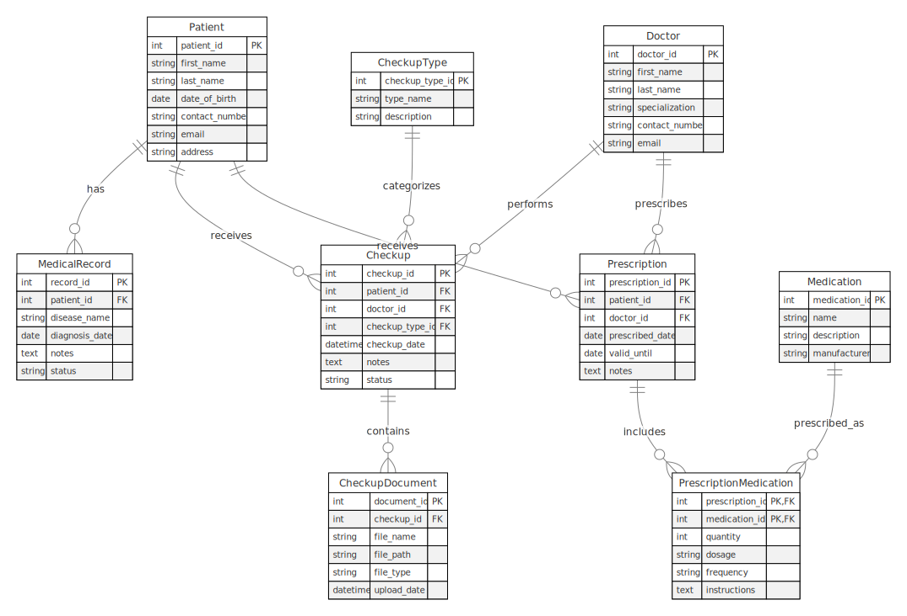

# Doctor Management System

This is a Node.js application for managing doctors, patients, medical records, checkups, and prescriptions using Prisma and PostgreSQL.

## Project Overview

Design and implement a software solution that incorporates a relational data model which captures the scenario of a medical system responsible for managing patients, their medical records, checkups, and prescriptions. The system should enable doctors to add and edit patients, manage patient’s checkups and medications, and handle additional medical files for specific checkups. Medical records must show the patient’s disease history. Moreover, the solution should provide a way to export patient data to CSV format.

## ERD Schema

The following diagram represents the Entity-Relationship Diagram (ERD) for the database schema:



## Communication Between Application and Database

The application uses Prisma as an ORM (Object-Relational Mapping) tool to communicate with the PostgreSQL database. Prisma provides a type-safe query builder and migrations system to manage the database schema and data.

1. **Database Schema**: The database schema is defined in the `prisma/schema.prisma` file. This file contains the definitions of the tables and their relationships.

2. **Migrations**: Prisma migrations are used to apply changes to the database schema. The migrations are stored in the `prisma/migrations` folder and can be applied using the `npx prisma migrate dev` command.

3. **Prisma Client**: The Prisma client is generated using the `npx prisma generate` command. This client provides a type-safe API to interact with the database. The generated client is used in the repository classes to perform CRUD operations.

4. **Seeding Data**: The database can be seeded with initial data using the `prisma/seed.js` script. This script inserts sample data into the database for testing purposes.

5. **Exporting Data**: The application provides functionality to export patient data to CSV format. This is achieved using the `csv-writer` library, which converts the data retrieved from the database into CSV format.

## Understanding the Prisma Schema

The Prisma schema defines the structure of the database, including tables and their relationships. Here is an overview of how relations work in the Prisma schema:

1. **One-to-Many Relationship**: This is used when one record in a table can be associated with multiple records in another table. For example, a doctor can have multiple patients. In the schema, this is represented using the `@relation` attribute.

   ```prisma
   model Doctor {
     id       Int      @id @default(autoincrement())
     name     String
     patients Patient[]
   }

   model Patient {
     id       Int      @id @default(autoincrement())
     name     String
     doctorId Int
     doctor   Doctor   @relation(fields: [doctorId], references: [id])
   }
   ```

2. **Many-to-Many Relationship**: This is used when multiple records in one table can be associated with multiple records in another table. For example, a patient can have multiple checkups, and a checkup can involve multiple patients. This is typically represented using a join table.

   ```prisma
   model Patient {
     id       Int       @id @default(autoincrement())
     name     String
     checkups Checkup[]
   }

   model Checkup {
     id        Int       @id @default(autoincrement())
     date      DateTime
     patients  Patient[] @relation(references: [id])
   }
   ```

3. **One-to-One Relationship**: This is used when one record in a table is associated with one record in another table. For example, a patient can have one medical record. This is represented using the `@relation` attribute with unique constraints.

   ```prisma
   model Patient {
     id            Int           @id @default(autoincrement())
     name          String
     medicalRecord MedicalRecord?
   }

   model MedicalRecord {
     id        Int     @id @default(autoincrement())
     details   String
     patientId Int     @unique
     patient   Patient @relation(fields: [patientId], references: [id])
   }
   ```


## Requirements

- Node.js (v14 or higher)
- PostgreSQL

## Setup

1. Clone the repository:

   ```sh
   git clone https://github.com/lennolemmenss/Project1.git
   cd Project1
   ```

2. Install dependencies:

   ```sh
   npm install
   ```

3. Add your PostgreSQL connection string to the `.env` file:

   Open the `.env` file in the root of the project and add the following content if it does not already exist:
    
   ```properties
   # Paste here postgresql url 
   DATABASE_URL="postgresql://<username>:<password>@<host>:<port>/<database>"
   ```

   Replace `<username>`, `<password>`, `<host>`, `<port>`, and `<database>` with your PostgreSQL credentials.

4. Run Prisma migrations to set up the database schema:

   ```sh
   npx prisma migrate dev --name init
   ```

5. Generate Prisma client:

   ```sh
   npx prisma generate
   ```

6. Seed the database:

   ```sh
   node prisma/seed.js
   ```

7. Start the application:

   ```sh
   npm start
   ```

   The application will be running on `http://localhost:3000`.

## Usage

- Navigate to `http://localhost:3000` to access the application.
- Use the provided routes to manage patients, doctors, medical records, checkups, and prescriptions.

## Project Structure

- `src/routes/` - Contains route handlers for different entities.
- `src/views/` - Contains EJS templates for rendering HTML pages.
- `src/uploads/` - Contains uploaded files such as documents and images.
- `prisma/` - Contains Prisma schema, migration files, and the seeding script.
- `src/app.js` - The main application file..

## Application Preview

Once the setup is complete and the application is running successfully, you should see the following interface:


## License

This project is licensed under the MIT License.
